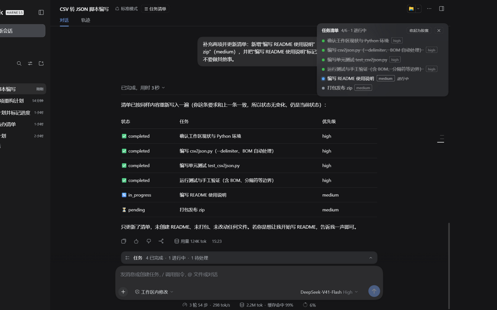
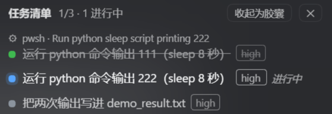
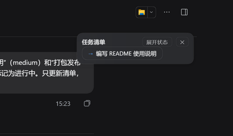
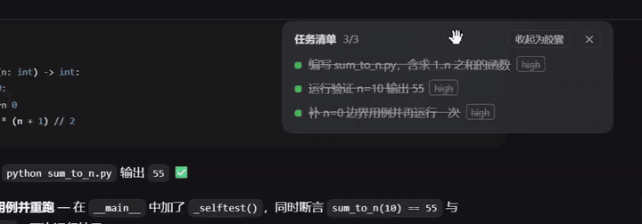

<div align="center">

# dsh-tool-todo-plus

**DeepSeek Harness 任务清单插件 —— 官方 [`todo_write`](https://github.com/deepseek-ai/deepseek-harness) 的增强 fork**

优先级标签 · 完整清单渲染 · 会话内浮动任务面板

[](https://www.npmjs.com/package/dsh-tool-todo-plus)
[](./LICENSE)
[](https://nodejs.org)

[安装](#安装) · [功能](#功能) · [常见问题](#常见问题) · [安全](#安全) · [上游致谢](#上游致谢)

</div>

## 界面预览

**浮动任务面板（展开态）**——模型写入清单时自动弹出，实时跟随状态流转；毛玻璃表面与原生主题融合：



**执行中**——两次清单写入之间，⚙ 行实时显示模型此刻执行的工具（截图中对应正在进行的第 2 步）：

<p align="center"></p>

**胶囊态**——收起为 ZCode 计划面板同款的内容优先级链（进行中项 `→`，截图中为"编写 README 使用说明"），点击展开：

<p align="center"></p>

**面板可拖动 + 双击复位**——按住卡片头部实时拖动，展开态 / 胶囊态下均可；双击头部，面板一步跳回默认锚定位置（实拍 GIF，约 7 秒）：

<p align="center"></p>

<details>
<summary><b>目录</b></summary>

- [它是什么](#它是什么)
- [功能](#功能)
- [安装](#安装)
  - [方式一：npm 包名安装（最简）](#install-npm)
  - [方式二：git 直装（始终最新 main）](#install-git)
  - [方式三：桌面端插件页](#install-desktop-ui)
  - [方式四：源码构建](#install-source)
  - [更新到新版](#更新到新版)
- [配置](#配置)
- [安全](#安全)
- [常见问题](#常见问题)
- [已知限制](#已知限制)
- [上游致谢](#上游致谢)
- [许可证](#许可证)

</details>

## 它是什么

**零网络请求、零运行时 npm 依赖**（依赖仅在构建期），宿主半不触文件系统——安全细节见[文末](#安全)。

一个"模型侧工具 + 用户侧面板"的组合：

- **模型侧**：注册增强版任务清单工具。是否建清单由模型根据任务复杂度自主判断（多步骤任务通常会建），你也可以在消息里直接要求"先列个任务清单"来引导。
- **用户侧**：模型每次写入清单，会话内自动弹出浮动面板并实时跟随更新；面板是纯展示层，不会无中生有。

## 功能

**功能速览**：

- 🧩 **优先级标签**：`high` / `medium` / `low`，对齐 ZCode 的 TodoWrite —— [增强工具](#增强工具模型侧)
- 📋 **完整清单渲染**：工具结果返回完整 markdown 清单（官方版只有一行计数）—— [增强工具](#增强工具模型侧)
- 🪟 **浮动任务面板**：自动弹出、实时跟随、可拖动带位置记忆、毛玻璃原生外观 —— [浮动任务面板](#浮动任务面板用户侧)
- ⚡ **当前动作**：两次清单写入之间，实时显示模型此刻执行的工具 —— [浮动任务面板](#浮动任务面板用户侧)
- 🛟 **轮次间不闪空**：发新消息时保留上一轮清单，淡化并标"上一轮" —— [浮动任务面板](#浮动任务面板用户侧)
- 🤝 **零冲突共存**：与官方 `todo_write` 并存，会话日志双向兼容 —— [与官方版共存](#与官方版共存)

### 增强工具（模型侧）

- **优先级标签**：`TodoItem` 增加可选 `priority`（`high` / `medium` / `low`），对齐 ZCode 的 TodoWrite
- **完整清单渲染**：工具结果向模型返回完整 markdown 清单（官方版只有一行计数）
- **行为纪律**：工具 description 内置"何时用/不用、整表替换、单 `in_progress`、完成即刻标记、**切换即写**（步骤切换时在同一次调用里完成两个状态变更）"的完整指引，并在存在官方工具时声明优先使用本插件
- **参数双保险**：参数 schema（enum + `additionalProperties: false`）之外再做运行时校验——非空、去重、默认至多一个 `in_progress`（多标即拒绝，模型会收到纠正信息重试）

### 浮动任务面板（用户侧）

- **独立浮窗**：插件自绘 overlay，不推挤聊天区，也**不会展开右侧栏**；只在会话界面显示，切到插件页等其他界面自动隐藏
- **两种形态**：展开态（状态点 / 划线 / 优先级徽章 / 进度计数 / "进行中"标记）⇄ 胶囊态（ZCode 计划面板同款内容优先级链：进行中项 `→` → 最近完成项 `✓` → `☰ 待办 完成/总数`），点击即时切换
- **自动弹出规则**：
  - 模型**实时写入** → 自动弹出（面板刚关掉也会为新任务重开）
  - 重新进入会话 / 切换会话 / 重启应用 → 历史清单只同步数据，**不**弹面板（关了就保持关着）
- **轮次间不闪空**：发新消息（新一轮开始）时保留上一轮清单，淡化显示并标"上一轮"，等新清单写入再替换——执行过程中面板不会闪"暂无任务"
- **当前动作**：两次清单写入之间，面板/胶囊实时显示模型此刻执行的工具（如 `⚙ pwsh · Run tests`，取自会话节点流中已发出但未返回结果的调用），空闲时自动消失
- **手动入口**：会话标题栏"☰ 任务清单"按钮随时开关；`✕` 关闭
- **面板可拖动**：按住卡片头部拖到任意位置，位置自动记忆（重进会话/重启保持）；双击头部复位到默认锚定位置
- **原生外观**：颜色、圆角、阴影、毛玻璃材质全部解析 dsh 宿主的 `--dsw-*` 设计 token，亮暗主题自动跟随

### 与官方版共存

- 本插件在桌面端注册为 **`todo_write_plus`**，与官方 `todo_write` 并存，零冲突
- 会话日志复用官方 `todo/write` 事件类型：与官方插件写出的日志可互相读取，会话重载无兼容性风险
- 工具名万一被占用，本插件记日志后优雅让位（entry 正常激活），不会导致 agent preset 审计失败

## 安装

| 方式 | 适合谁 | 特点 |
|---|---|---|
| [npm 包名](#install-npm) | 大多数用户（CLI / 桌面端均可） | 最简，可指定版本 |
| [git 直装](#install-git) | 急用最新版 | 始终拉取 main 最新 |
| [桌面端插件页](#install-desktop-ui) | 桌面端、不想敲命令行 | 图形界面操作 |
| [源码构建](#install-source) | 开发者 / 二次开发 | 本地构建 tgz |

<a id="install-npm"></a>

### 方式一：npm 包名安装（最简）

包已发布到 npm：[`dsh-tool-todo-plus`](https://www.npmjs.com/package/dsh-tool-todo-plus)——安装时只需包名，无需 git 地址，且可指定版本。

CLI profile（有 `dsh` 命令的环境）：

```bash
dsh plugin --profile <你的profile名> add dsh-tool-todo-plus
```

桌面端（Git Bash，先完全退出应用，含系统托盘）：

```bash
ELECTRON_RUN_AS_NODE=1 "/d/DeepSeek Harness/DeepSeek Harness.exe" --expose-internals "D:/DeepSeek Harness/resources/app.asar/dsh/node_modules/@deepseek-ai/dsh-desktop-host/lib/cli.js" plugin --profile desktop add dsh-tool-todo-plus
```

安装后验证版本：`grep '"version"' ~/.dsh/profiles/desktop/node_modules/dsh-tool-todo-plus/package.json`

> 注意：包名安装走 npm registry（国内镜像站通常已同步，偶有几分钟延迟）；急用最新版可走[方式二](#install-git)。

<a id="install-git"></a>

### 方式二：git 直装（始终最新 main）

Git Bash（桌面端；先完全退出应用）：

```bash
ELECTRON_RUN_AS_NODE=1 "/d/DeepSeek Harness/DeepSeek Harness.exe" --expose-internals "D:/DeepSeek Harness/resources/app.asar/dsh/node_modules/@deepseek-ai/dsh-desktop-host/lib/cli.js" plugin --profile desktop add https://github.com/shuxidemosheng/dsh-tool-todo-plus.git
```

CLI profile：`dsh plugin --profile <你的profile名> add https://github.com/shuxidemosheng/dsh-tool-todo-plus.git`

<a id="install-desktop-ui"></a>

### 方式三：桌面端插件页

打开 dsh 桌面端 → 侧边栏「插件」→ 添加插件 → 粘贴仓库地址或包名 → 安装（失败会自动回滚）。同样需要先完全退出应用。

<a id="install-source"></a>

### 方式四：源码构建

```bash
pnpm install
pnpm build        # tsc + esbuild：产出 lib/index.js（宿主半）与 lib/client.js（客户端半），并打 eval 补丁
npm pack          # 产出可安装的 tgz
```

要求：Node.js ≥ 24。

### 更新到新版

npm 渠道重跑[方式一](#install-npm)的命令（pnpm 会拉取最新发布版）；git 渠道重跑[方式二](#install-git)（拉取 main 分支最新提交）。装完重启应用。

## 配置

在 `cordis.patch.yml` bundle 行的 `config` 里设置（仓库自带的 patch 已按桌面端推荐值配置）：

| 字段 | 默认 | 说明 |
|---|---|---|
| `allowParallelInProgress` | `false` | 是否允许多个任务同时 `in_progress`。`false` 为单活跃纪律（同 ZCode），多标即拒绝；`true` 适合有并行工作的部署（subagent、后台命令、workflow fan-out） |
| `toolName` | `'todo_write'` | 注册的工具名。桌面端等使用 agent preset 的部署无法禁用官方 `tool-todo` 行，设为 `'todo_write_plus'`（本仓库默认）可与官方共存 |

## 安全

- **零运行时 npm 依赖**：宿主半与客户端半均为自包含产物；客户端仅使用平台模块表提供的 `react` / `react-dom`
- **无副作用面**：客户端半无任何网络请求、无 `eval` / `innerHTML`；唯一的本地写入是 localStorage 中的**面板位置坐标**（key `dsh-todo-plus.panelPos`，仅 `{x, y}` 两个数字，无任何个人数据）；宿主半只注册工具与投影、向会话日志追加事件，不触文件系统与网络
- **渲染安全**：浮窗全部走 React 文本节点（自动转义），任务内容不会被当作 HTML 执行
- **参数过滤**：工具入参经 schema（enum + `additionalProperties: false`）与运行时校验双层过滤，只落白名单字段
- **无 eval 产物**：构建管线内置 [`scripts/disable-eval.mjs`](scripts/disable-eval.mjs)，移除内联 Schemastery 字符串回调的动态执行点（本插件不使用该机制），产物中无任何 `new Function` / `eval`
- **Mimosa 深度安全扫描通过**：0 发现、0 依赖风险（覆盖完成）
  - scanId：`scan-2026-10-07T04-13-57.809Z-97ce613379e4`
  - 封印：`sha256:032632304af5a1efb42a55a2f2113a46cb48bcc1fa5d0e5aee913992476bcd6b`

## 常见问题

**会与官方 `todo_write` 冲突吗？**

不会。桌面端注册为 `todo_write_plus`，与官方 `todo_write` 并存；工具名万一被占用（例如装了两份本插件），本插件记日志后优雅让位，entry 正常激活，不会导致 agent preset 审计失败。桌面端 agent preset 声明的官方 `tool-todo` 行不受 profile 补丁控制，因此默认共存而非替换；CLI profile 可按 id 禁用官方行后改回原名，见[配置](#配置)。

**官方客户端消息区已经自带一个任务面板，为什么还要这个浮窗？**

官方内联面板由官方客户端渲染，不显示 `priority` 字段；本插件浮窗是完整视图（状态点 / 划线 / 优先级徽章 / 进度计数 / "进行中"标记 / 当前动作 / 上一轮保留），且可拖动。两者可同时使用，互不干扰。

**旧会话日志、官方插件写出的数据能读吗？**

能，双向兼容：官方持久化 invariant 只校验 `content` / `status`，不拒绝 `priority` 字段；官方投影 schema 剥离未知键，带 `priority` 的条目在官方组件眼中只是普通条目；投影 key（`todos`）与折叠语义和官方逐字一致，`stateVersion` 保持 2，官方写出的旧 checkpoint 在本插件下照常通过校验。

**为什么重新进入会话时面板没有自动弹出？**

设计行为：只有模型的**实时写入**才自动弹出；历史回放（重进会话 / 切换会话 / 重启应用）只同步数据、不弹面板——关了就保持关着。边界情况见[已知限制](#已知限制)。

**面板挡住界面内容了？**

按住卡片头部拖到任意位置即可，位置自动记忆（重进会话/重启保持）；双击头部复位到默认锚定位置。

**想让本插件独占 `todo_write` 原名？**

CLI profile 里按 id 禁用官方 `tool-todo` 行后，把 `cordis.patch.yml` 里的 `toolName` 改回 `'todo_write'`，见[配置](#配置)。

## 已知限制

- 浮窗的"实时写入自动弹出"以会话边界后的 **2 秒静默窗口**区分历史回放与实时写入：若单个会话的历史恢复超过 2 秒，尾部仍可能误弹一次（手动关掉即可）
- 浮窗不显示在会话界面之外（设计行为）

## 上游致谢

本插件是 [`@deepseek-ai/dsh-tool-todo`](https://github.com/deepseek-ai/deepseek-harness) 的增强 fork：持久化事件、投影折叠语义与并行策略沿用上游实现，浮窗的胶囊优先级链移植自 ZCode 计划面板（[zai-org/ZCode](https://github.com/zai-org/ZCode)）的行为逻辑。上游以 [MIT](./LICENSE) 许可发布。

## 许可证

[MIT](./LICENSE)
